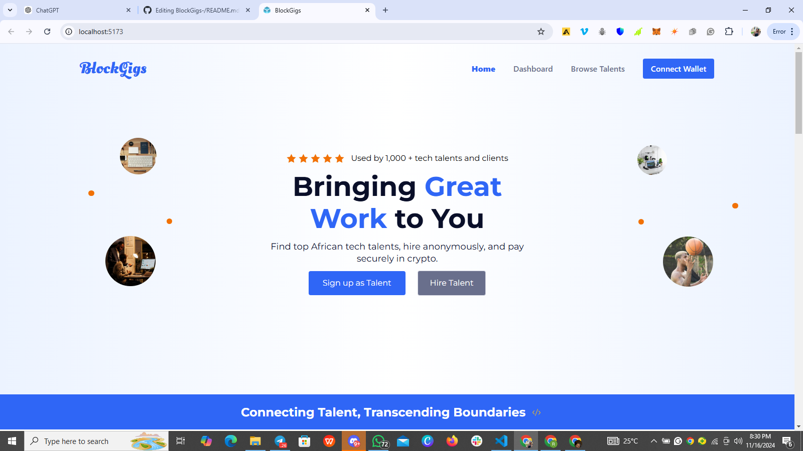
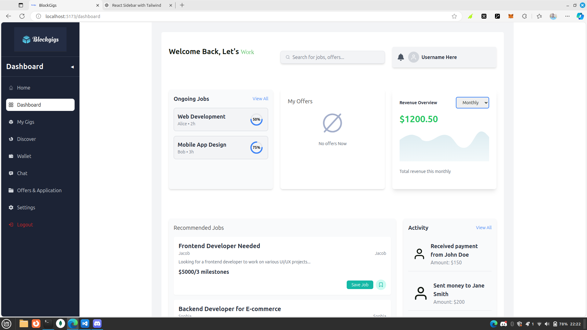

# React + Vite

This template provides a minimal setup to get React working in Vite with HMR and some ESLint rules.

Currently, two official plugins are available:

- [@vitejs/plugin-react](https://github.com/vitejs/vite-plugin-react/blob/main/packages/plugin-react/README.md) uses [Babel](https://babeljs.io/) for Fast Refresh
- [@vitejs/plugin-react-swc](https://github.com/vitejs/vite-plugin-react-swc) uses [SWC](https://swc.rs/) for Fast Refresh
<<<<<<< HEAD





# BlockGigs

BlockGigs is a decentralized hiring platform that connects Africa’s top talent with innovative companies, creating new opportunities in blockchain and Web3. Whether you're a professional looking for your next big role or a company searching for exceptional blockchain talent, BlockGigs streamlines the hiring process with anonymous profiles, secure matching, and seamless payment.

We’re not just building a platform; we’re building the future of work in Web3. Join us on this journey as we help blockchain professionals connect with companies that drive technological advancement and innovation in Africa and beyond.

---

## Table of Contents

1. [About BlockGigs](#about-blockgigs)
2. [Core Features](#core-features)
3. [Getting Started](#getting-started)
4. [How It Works](#how-it-works)
5. [Platform Goals](#platform-goals)
6. [Technologies Used](#technologies-used)
7. [Contributing](#contributing)
8. [License](#license)
9. [Contact](#contact)

---

## About BlockGigs

BlockGigs is the Web3-enabled hiring platform redefining the job search experience in the blockchain industry. As a decentralized marketplace, BlockGigs connects Africa’s skilled blockchain professionals with global companies seeking top-tier talent, creating a seamless bridge between opportunity and expertise.

Designed to meet the unique demands of the blockchain space, BlockGigs prioritizes privacy, efficiency, and security. The platform facilitates anonymous hiring, enabling professionals and organizations to connect without compromising their data. It also streamlines collaboration, ensuring smooth workflows for all parties involved, while its secure payment system guarantees trust and transparency throughout the hiring process. BlockGigs is shaping a future where blockchain talent and opportunities thrive together in harmony.

### Why BlockGigs?

- **Empowering African Talent**: We open doors for African blockchain professionals, connecting them to remote opportunities with leading global companies.
- **Built for a Decentralized Future**: BlockGigs leverages cutting-edge decentralized technology to deliver a secure, transparent, and efficient hiring experience.
- **Privacy-First Approach**: Our platform enables anonymous hiring, ensuring that candidates and companies can connect without compromising their privacy.
- **Secure and Seamless Payments**: BlockGigs guarantees effortless, secure transactions, ensuring professionals are paid promptly for their work.

---

## Core Features

### For Blockchain Professionals

- **Privacy-First Profiles**: Create an anonymous profile that highlights your skills and experience, revealing your identity only when you're ready.
- **Intelligent Job Matching**: Leverage advanced algorithms to connect with roles perfectly aligned with your expertise and career goals.
- **Decentralized Secure Payments**: Enjoy seamless and secure transactions, ensuring prompt payment for your completed projects.
- **Growth and Networking**: Unlock opportunities for professional development, including training programs and networking with industry leaders.

### For Companies

- **Discover Exceptional Talent**: Access Africa’s top blockchain professionals, including developers, designers, and project managers, ready to bring your vision to life.
- **Streamlined Hiring Process**: Connect with candidates anonymously, conduct interviews, and onboard seamlessly for a hassle-free experience.
- **Secure and Transparent Payments**: Leverage decentralized payment systems for quick, reliable, and transparent transactions.
- **Effortless Project Scaling**: Scale your projects efficiently by hiring skilled talent on demand to meet your business needs.

---

## Getting Started

### For Professionals

1. **Sign Up**: Visit [www.blockgigs.xyz] to create an account.
2. **Complete Profile**: Add your skills, experience, and portfolio to build a comprehensive anonymous profile.
3. **Browse Jobs**: Use the job board to search for roles that match your skill set and interests.
4. **Apply and Connect**: Apply for jobs, chat with employers, and receive offers.
5. **Get Paid**: Work on projects and get paid seamlessly through our decentralized payment system.

### For Companies

1. **Register Your Company**: Visit [www.blockgigs.xyz] and create an account for your company.
2. **Post a Job**: Provide details about the role, skills required, and project specifications.
3. **Review Candidates**: View anonymous profiles of applicants and shortlist those who meet your needs.
4. **Interview and Hire**: Connect directly, conduct interviews, and onboard selected candidates.
5. **Secure Payments**: Enjoy seamless, secure transactions for projects delivered.

---

## How It Works

1. **Sign Up & Create Profile**: Both professionals and companies create profiles on BlockGigs. Professionals can keep their profiles anonymous until they’re ready to reveal details.
2. **Find a Match**: Companies post job listings, and professionals apply to those that match their skill sets.
3. **Connect & Interview**: Once a match is made, companies can invite professionals for an interview or proceed with hiring directly.
4. **Secure Payment Handling**: Upon successful hiring and project completion, payments are processed through a decentralized and secure system.

---

## Platform Goals

- **Decentralized Hiring**: To create a truly decentralized hiring experience for blockchain talent and companies.
- **Anonymity and Privacy**: Protect user identities until both parties agree to reveal their details, ensuring privacy in hiring.
- **Blockchain Inclusion**: Empower blockchain professionals from Africa by providing access to global job opportunities.
- **Secure Transactions**: Enable secure, transparent transactions with decentralized payment methods.

---

## Technologies Used

BlockGigs is powered by Web3 and blockchain technologies to ensure secure, decentralized operations.

- **React**: Powers the frontend, ensuring a dynamic and responsive user interface.
- **TailwindCSS**: Enables modern, scalable, and highly customizable styling for a seamless user experience.
- **Vite**: Optimizes development with a fast and efficient build process.
- **React-Icons**: Provides scalable and customizable icons to enhance UI design.
- **Metamask Delegation Integration**: Facilitates secure wallet connections and decentralized authentication.
- **Smart Contracts**: Automates transactions and contractual agreements for secure and transparent operations.
- **Celo Blockchain Protocol**: The foundation for decentralized transactions, leveraging Celo’s scalability and eco-friendly design.
- **Typescript and Next.js**: Handles backend operations and database management for robust and efficient performance.
- **Decentralized Identity Solutions**: Ensuring secure identity management and authentication.
- **IPFS**: Decentralized file storage for user data and job postings.
- **PostgreSQL**: Manages and organizes all the data for activities on BlockGigs, ensuring efficient storage, retrieval, and seamless handling of user and platform information.

---

## Contributing

We’re excited to have you contribute to **BlockGigs** and help us improve the platform! Follow these steps to get started:

### 1. Fork the Repository  
Create your own copy of the repository by forking it.  

### 2. Create a New Branch  
Create a branch for your feature or bug fix and name it descriptively:  

```bash  
git checkout -b feature/your-feature-name  
```  

### 3. Make Your Changes  
Implement your changes and commit them with clear, concise commit messages:  

```bash  
git commit -m "Add a detailed description of your changes"  
```  

### 4. Push Your Changes  
Push your branch to your forked repository:  

```bash  
git push origin feature/your-feature-name  
```  

### 5. Open a Pull Request  
After pushing your branch, open a pull request to the main repository. Include a detailed description of your changes and why they’re important.  

---

## License  

This project is licensed under the MIT License. For more details, check the [LICENSE](./LICENSE) file.  

---

## Contact  

Have questions, feedback, or suggestions? Reach out to us:  

- **Email**: [info.rubiconconsulting@gmail.com](mailto:info.rubiconconsulting@gmail.com)  
- **LinkedIn**: [@Rubikcon](https://www.linkedin.com/company/rubicon-consults/)  

---

## Join Us  

Join us in transforming the hiring landscape and shaping the future of decentralized work. Sign up today and take a bold step toward advancing your career or growing your company with BlockGigs!  

---  

=======
>>>>>>> web-app-forms
